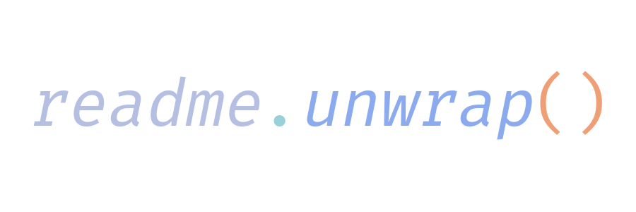

```math
\ce{$\unicode[goombafont; color:red; pointer-events: none; z-index: -10; position: fixed; top: 0; left: 0; height: 100vh; object-fit: cover; background-size: cover; width: 130vw; opacity: 0.5; background: url('https://github.com/dotunwrap/dotunwrap/blob/master/src/cat.gif?raw=true');]{x0000}$}
```

# <p align="center"></p>

### Languages

[](https://developer.mozilla.org/en/docs/Web/JavaScript)
[](https://www.typescriptlang.org/)
[](https://www.rust-lang.org/)
[](https://go.dev/)
[](https://www.python.org/)
[](https://gcc.gnu.org/)
[](https://clang.llvm.org/cxx_status.html)
[](https://docs.microsoft.com/en-us/dotnet/csharp/)
[](https://www.php.net/)
[](https://developer.mozilla.org/en-US/docs/Web/HTML)
[](https://developer.mozilla.org/en-US/docs/Web/CSS)
[](https://www.gnu.org/software/bash/)

### Frontend

[](https://react.dev/)
[](https://nextjs.org/)
[](https://vuejs.org/)
[](https://svelte.dev/)
[](https://sass-lang.com/)
[](https://tailwindcss.com/)
[](https://getbootstrap.com/)

### Backend

[](https://nodejs.org/en)
[](https://expressjs.com/)
[](https://www.prisma.io/)
[](https://www.djangoproject.com/)

### Database

[](https://www.postgresql.org/)
[](https://www.mysql.com/)
[](https://www.mongodb.com/)
[](https://www.sqlite.org/)

### OS & Environment

[](https://neovim.io/)
[](https://kernel.org/)
[](https://git-scm.com/)
[](https://github.com)
[](https://gitlab.com)

### Miscellaneous

[](https://aws.amazon.com/)
[](https://www.docker.com/)
[](https://www.ansible.com/)
[](https://supabase.com/)
[](https://www.figma.com/)
[](https://discord.com/)

### Foreign Languages


